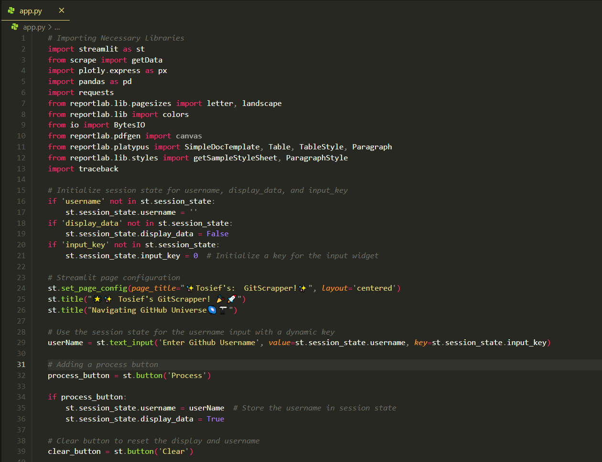
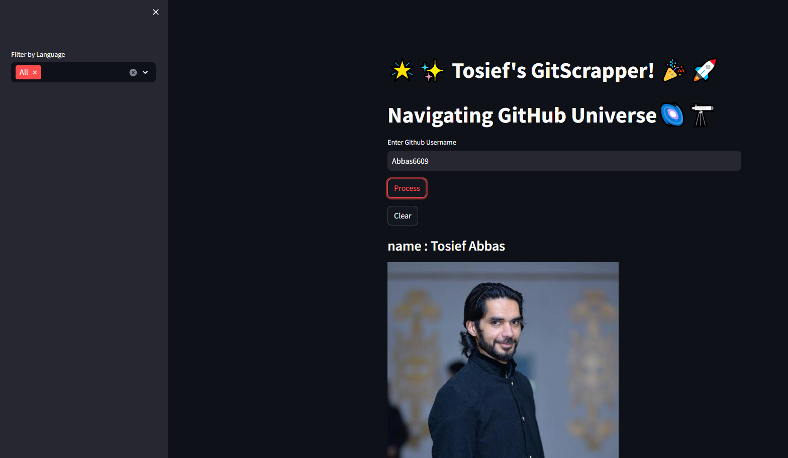
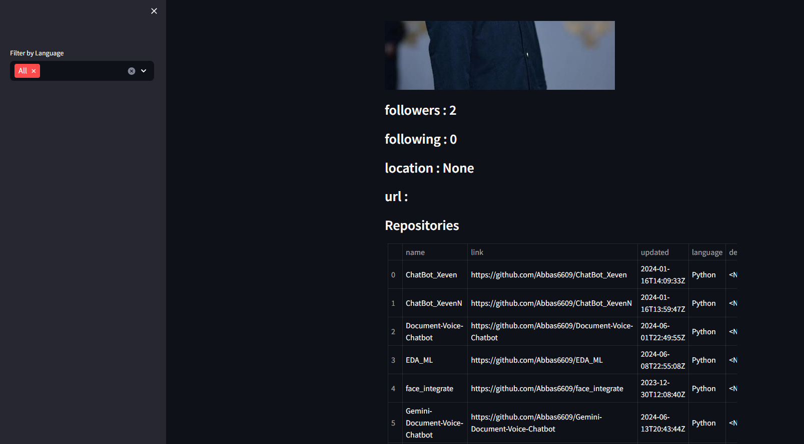
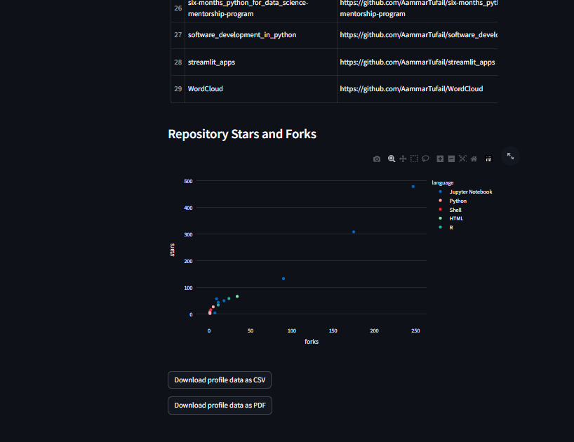

"# GitHub-Profile-Scraper" 

## **01- Snapshot of the application's backend code in an IDE, highlighting the Streamlit and Scrape libraries**

## **02- Initial interface of the GitHub scraping application, showcasing the username input and process button**

## **03- Detailed user interface displaying profile information including follower count, following count, and repositories**

## **04- Profile view of another GitHub user showing name, follower details, and a list of repositories**

## **05- Visualization of repository stars and forks within the application, providing a graphical representation of user engagement**

